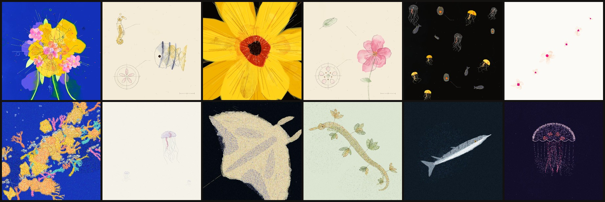

# Generative Painting Skills

**Agent skills for making hand-painted-looking films and paintings entirely in code.** Describe a subject, pick a painting style (or let the agent pick), and your coding agent plans a shot list, paints every frame procedurally, scores it, and exports a verified film.

Works with **Claude Code, OpenAI Codex, Cursor** and any agent that reads `SKILL.md` skills.



<sub>Top: watercolour. Bottom: pointillism. Every image is generated by JavaScript at render time: no photos, no scans, no AI image models.</sub>

---

## What's inside

One skill, **`generative-painting`**, with a pluggable set of **six** painting styles:

| Style | What it looks like | Example film |
|---|---|---|
| **Watercolour** | translucent glazes that bleed and mix like pigment; graphite and ink, hatching, speckle and paper; antique scientific illustration colliding with editorial design | [contact sheet](skills/generative-painting/styles/watercolour/examples/beautiful-collisions-contact.jpg) · [ocean version](skills/generative-painting/styles/watercolour/examples/tidal-collisions-contact.jpg) |
| **Pointillism** | pictures built from thousands of distinct divided-colour dabs, in the tradition of Seurat and Signac | [contact sheet](skills/generative-painting/styles/pointillism/examples/ocean-of-points-contact.jpg) · [same film, both styles](skills/generative-painting/styles/pointillism/examples/translation-watercolour-vs-pointillist.jpg) |
| **Charcoal** | directional charcoal and smudge on toothy paper, eraser highlights, one red conté accent; draws itself on stroke by stroke | [demo](skills/generative-painting/styles/charcoal/examples/charcoal-demo-contact.jpg) |
| **Sketch** | graphite hatching and searching contours, or crisp pen and ink | [demo](skills/generative-painting/styles/sketch/examples/sketch-demo-contact.jpg) |
| **Woodcut** | relief print: ink, carved paper, gouged greys, a misregistered red block | [demo](skills/generative-painting/styles/woodcut/examples/woodcut-demo-contact.jpg) |
| **2D cel** | flat animation paint, hard cel shadow, thick-thin ink line, line boil on twos | [demo](skills/generative-painting/styles/cel/examples/cel-demo-contact.jpg) |
| **Mixed** | any of these, chosen per plate and switched at cuts | [six materials, one film about anger](skills/generative-painting/references/mixed-film-example-six-materials.jpg) · [16:9 montage with text](skills/generative-painting/references/mixed-film-example.jpg) |
| **Your style** | risograph, mosaic, ink wash, cross-stitch, pixel art… | [how to add one](#create-a-new-style) |

It also ships:
- a runnable engine (p5.js + p5.brush + Vite + Playwright + ffmpeg);
- 38 finished paintings to start from;
- particle motion, plus motion that belongs to each medium: **draw-on** (drawings appear stroke by stroke) and **line boil** (hand-drawn 2D);
- a quiet generative score;
- an export pipeline that **proves** its output (bit-identical holds, deterministic seeking, encode fidelity).

## Install

```bash
git clone https://github.com/debuu0007/generative-painting-skills.git
cd generative-painting-skills
./install.sh              # symlinks the skill into every agent found: ~/.claude, ~/.codex, ~/.cursor, ~/.agents
./install.sh claude       # …or just one agent (claude | codex | cursor | agents)
./install.sh --copy codex # copy instead of symlink
```

Or copy `skills/generative-painting/` into your agent's skills folder by hand. Then restart the agent.

**Requirements:**
- Node 18+ and ffmpeg.
- Python 3 with numpy and scipy, for the analysis tools.
- The first scaffold installs p5 2.3.3, p5.brush 2.2.3 (pinned), Vite and Playwright's Chromium.

## Use it

Just ask your agent:

> *Make a 20-second watercolour film about wildflowers.*
> *A pointillist loop of a coral reef at night.*
> *Remake this film as pointillism.*
> *A 16:9 montage with the sentence "the sea remembers" over it, mixing watercolour and pointillism.*
> *One large pointillist painting of a lighthouse, as a PNG.*

The agent will:
1. Show a **shot list** before painting.
2. Scaffold a project and paint each plate, looking at it at full size.
3. Export and run the checks, then report what it verified and what it couldn't (for example, that it measured the audio but didn't listen to it).

Without an agent:

```bash
skills/generative-painting/scripts/new-film.sh --list                          # installed styles
skills/generative-painting/scripts/new-film.sh --style pointillism ~/reef reef  # engine + demo film
cd ~/reef && npm run export    # → out/reef/: MP4s, WAV, lossless plates, contact sheet, checks.json
npm run dev                    # live preview at http://localhost:5173
```

## How it works

```
  scene (what & where)        material (how it becomes paint)        edit (when, with checks & sound)
  src/scenes/*.js        →    watercolour · pointillism · yours   →   film.js · renderer · export
  seeded drawing kit          one hook per style                      cuts, holds, particles, score
```

- **Plates, not frames.** Each painting is drawn once by code, cached and held. Films are hard cuts between plates, with rare particle motion computed as a pure function of time. Every frame is reproducible from its number.
- **Geometry and material are separate.** In pointillism the watercolour drawing is recorded call by call and replayed as dots. So any scene works in any style, and a film can be repainted in a new style with geometry that is provably identical.
- **The edit is a collision.** Every ordinary cut changes at least three of six axes: ground value, palette, density, scale, mark organisation and composition. That rule is what makes a sequence of still paintings feel alive.

## Choosing a style

| If the brief is… | Use |
|---|---|
| botanical, archival, delicate, a notebook, antique science, quiet | **watercolour** |
| luminous, textured, glowing, crowds, reefs, stars, "made of dots" | **pointillism** |
| weight, tension, grief, aftermath, figures | **charcoal** |
| calm, notes, diagrams, a crack spreading, a count growing | **sketch** |
| force, violence, declaration | **woodcut** |
| mechanisms, clocks, impacts, moving parts | **2D cel** |
| an emotional arc, variety or discovery; a launch; a montage with a sentence over it | **mixed** |

**When a mixed film should cut to pointillism:**
- Treat pointillism as *punctuation*: about one plate in four, never more than two in a row, placed at the energy peaks.
- Change material only at a cut, and always change ground value with it.
- Keep text, diagrams and small faces on watercolour grounds.
- Anything that will dissolve into moving dots should already be pointillist while it's still.

The full guide is [`choosing-and-mixing-styles.md`](skills/generative-painting/references/choosing-and-mixing-styles.md).

## The house pattern, and how to break it

Every film so far follows the same pattern:
- a dense saturated opener;
- a near-empty breath;
- dark/pale alternation;
- two particle passages;
- an "almost nothing" beat;
- a hero plate and its crop;
- a 3-second monument;
- a quiet archival close;
- a loop back to the opener;
- a quiet score around −22 LUFS.

**That pattern is a default, not a law.** The skill separates three tiers:

| Tier | Examples | Change it? |
|---|---|---|
| **Invariants** | seeded randomness, cached plates, pure-function motion, pinned libraries, checks pass | never: they keep the tool working |
| **Style laws** | tactile marks (no blur or filters), one palette family per plate, silhouette first, hard cuts, stillness as default | only on purpose, and say so |
| **Defaults** | opener, dark/pale alternation, cut-rule strength, rhythm, format, text, sound, material | **experiment freely** |

The cheapest experiments with the most effect, in order:
1. shot order (no repainting needed);
2. the opener;
3. ground-value rhythm;
4. palette families;
5. cut-rule strength;
6. shot lengths;
7. material mix;
8. motion;
9. format and text;
10. sound.

Change one dial at a time with seeds frozen, and compare contact sheets. See [`experimenting.md`](skills/generative-painting/references/experimenting.md).

## Create a new style

A style replaces only the **material** layer. Scenes, editing, particles, sound, export and checks are shared, so every one of the 38 library paintings works in your style on day one.

1. Run `cp -R skills/generative-painting/styles/_template skills/generative-painting/styles/<name>` and add a demo `film.js` with `STYLE = '<name>'`.
2. Register a material in `engine/src/plate-page.js`. A **replay** style (`record: true`) re-renders the recorded shapes, lines and hatches with your marks. A **direct** style (`record: false`) draws with its own kit.
3. Calibrate on three plates (dark and dense, pale and sparse, a line diagram), then give the style at least three mark organisations so cuts can vary texture.
4. Pass the acceptance list:
   - the checks pass;
   - the capture is pixel-identical;
   - it reads as the style at 96 px, not as a filter;
   - `STYLE.md` documents its limits and how it mixes.

The step-by-step guide, with a code skeleton and a map of candidate styles (woodcut, risograph, mosaic, sumi-e, cross-stitch, pixel art), is [`adding-a-style.md`](skills/generative-painting/references/adding-a-style.md). Contributions are welcome; see [CONTRIBUTING.md](CONTRIBUTING.md).

## What an export contains

`out/<film>/` contains:
- the MP4 master and delivery files;
- the WAV;
- `plates/` (a lossless PNG per painting);
- a labelled contact sheet and per-shot anchor frames;
- `manifest.json` (seeds, plate hashes, audio loudness);
- `checks.json`.

The checks confirm that:
- held frames are bit-identical;
- motion shots move and every cut changes the image;
- the loop closes exactly;
- out-of-order seeks match sequential capture;
- the encode matches the lossless frames (measured in YUV).

Square films render a 600² master plus a Lanczos-upscaled 1080² MP4, and the files say so. 16:9 films can be painted at a genuine 1920×1080 ([`widescreen-and-titles.md`](skills/generative-painting/references/widescreen-and-titles.md)).

## Repository layout

```
install.sh                         one-command install for Claude Code / Codex / Cursor
skills/generative-painting/
  SKILL.md                         the entry point agents read
  engine/                          runnable project template (src/, scripts/export.mjs, tools/)
  styles/watercolour/              STYLE.md, style DNA, archetypes, demo, 19-painting library, examples
  styles/pointillism/              STYLE.md, material calibration, translation guide, demo, 19-painting library, examples
  styles/charcoal/, sketch/, woodcut/, cel/   STYLE.md, demo, examples (replay materials in engine/src/materials/)
  styles/_template/                start here for a new style
  references/                      choosing & mixing · motion in the medium · experimenting · editing ·
                                   drawing kit · widescreen & titles · sound · verifying · adding a style
  scripts/new-film.sh              scaffold a film in any installed style
docs/banner.jpg
```

## Credits and licence

- The code, documentation and example images in this repository are released under the [MIT License](LICENSE).
- Built on [p5.js](https://p5js.org) (LGPL-2.1) and [p5.brush](https://github.com/acamposuribe/p5.brush) by Alejandro Campos (MIT). Both are installed from npm, unmodified, and not redistributed here.
- All artwork and sound are generated by code at render time. No images, samples or fonts are embedded in the frames.
