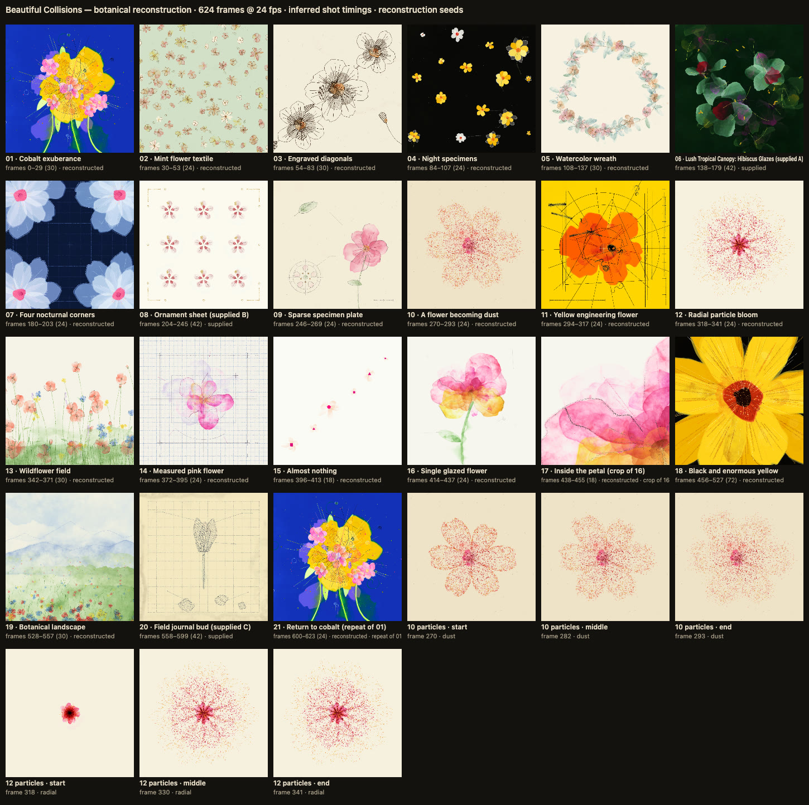
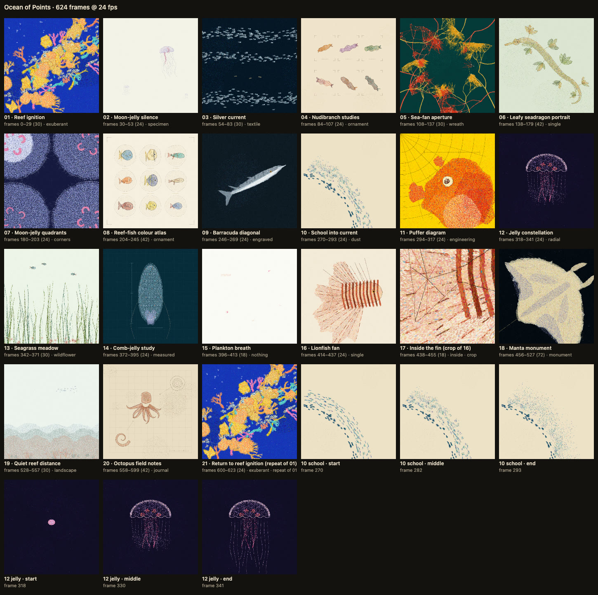

# generative-painting

An agent skill (for Claude Code, Codex, Cursor, and any agent that reads `SKILL.md` skills) for making **hand-painted-looking generative paintings and short art films in code**. Pick a painting style, describe a subject, and the agent plans a shot list, paints each plate procedurally and exports a finished, verified film.

| Watercolour ("Beautiful Collisions") | Pointillism |
|---|---|
|  |  |

## Styles

- **`watercolour`**: translucent glazes that bleed and mix like pigment, graphite and ink lines, hatching and speckle on varied paper. Antique scientific illustration collides with editorial design, cut into a rhythmic montage.
- **`pointillism`**: pictures built from thousands of distinct divided-colour dabs. It can also **repaint an existing watercolour film as pointillism with provably identical geometry**: the source painting is re-created through a recording proxy and must match the original pixel for pixel before any dot is placed.

- **`charcoal`**, **`sketch`** (graphite or ink), **`woodcut`** and **`cel`** (2D animation): replay materials that repaint the same recorded drawing, with draw-on and line boil (`references/motion-in-the-medium.md`).
- **mixed**: any of these in one film, chosen per plate and switched only at cuts (`references/choosing-and-mixing-styles.md`).

More styles plug in through one material hook (`references/adding-a-style.md`, starting from `styles/_template/`). Films can also be 16:9 at a genuine 1080p, with fixed-anchor on-screen text and pixel characters (`references/widescreen-and-titles.md`). What's a law and what's merely the default pattern is in `references/experimenting.md`.

## Install

Copy or clone this folder into your agent's skills directory, for example `~/.claude/skills/generative-painting`, `~/.codex/skills/…`, `~/.cursor/skills/…`, or a shared `~/.agents/skills/` linked into each. Then ask for something like *"a watercolour film about wildflowers"*, *"a pointillist reel of coral reefs"*, or *"remake this film as pointillism"*.

## Use it without an agent

```bash
scripts/new-film.sh --list                                    # available styles
scripts/new-film.sh --style pointillism ~/my-film my-film     # copies engine + demo, installs deps
cd ~/my-film && npm run export                                # demo -> out/my-film/ (MP4s, WAV, plates, checks)
npm run dev                                                   # live preview at http://localhost:5173
```

Requirements: Node 18+, ffmpeg, and Python 3 with numpy and scipy for the analysis tools. The scaffold script installs Playwright's Chromium.

Edit `src/film.js` (style, shots, plates) and `src/scenes/` (one file per painting). Documentation starts at `SKILL.md`.

## What you get

`out/<id>/` contains:
- `<id>-native.mp4` (600², master);
- `<id>.mp4` (1080², a Lanczos upscale, not a re-render);
- `<id>.wav`;
- `plates/` (lossless PNG per painting);
- a labelled contact sheet and per-shot anchors;
- `manifest.json` and `checks.json`.

The checks confirm that:
- held frames are bit-identical and moving frames are deterministic;
- every cut changes the image and the loop closes exactly;
- encode fidelity and frame counts are correct.

Analysis tools cover the six-axis cut audit, thumbnail colour fidelity and a real-time playback check.

## Third-party software

- [p5.js](https://p5js.org) (LGPL-2.1) and [p5.brush](https://github.com/acamposuribe/p5.brush) (MIT), installed from npm and served unmodified;
- Vite and Playwright as dev tools, and ffmpeg at export.

All artwork and sound are generated by code at render time; no images, samples or fonts are embedded in the frames.
